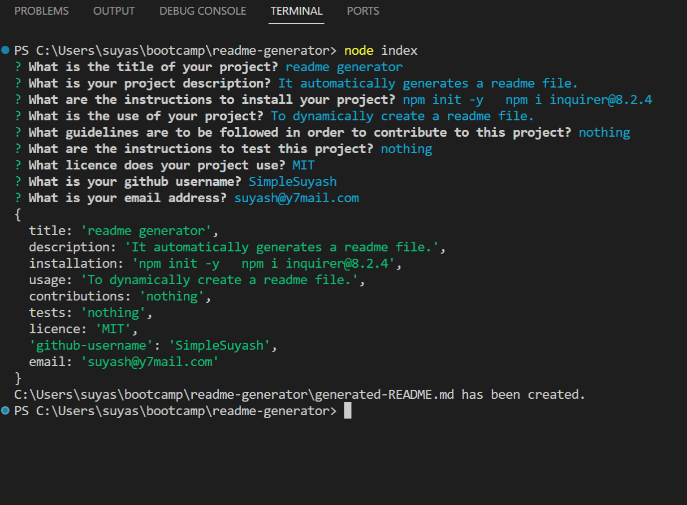

https://img.shields.io/badge/Windows%20Terminal-blue?style=for-the-badge&logo=windows%20terminal&logoColor=white&labelColor=red&color=brightgreen [](https://nodejs.org/en) [](https://www.npmjs.com/) [](https://www.npmjs.com/package/inquirer)

<div align="right"> 
<a href= "http://www.wtfpl.net/about/"></a>
</div>

# README.md Generator

This app creates a professional README.md file with sections such as: Table of Contents, Description, Installation, Usage, Contributing, Test, Licence and Questions by capturing the user's answers to the prompts in the command-line interface.

##  Description

README.md is a very important page in a repository. But often, it can be confusing what sections to include and how to put them properly using Markup language. Also, including a licence can be equally confusing. One may not know what the available options are, and what the corresponding links and badges are. This app simplifies this daunting process by automating the process of creating README.md file. 

This app is built so that I can use it to generate a basic README.md file for other projects and add/remove other sections as needed. By creating this project, I learnt the *inquirer npm package*, and also learnt to install the *Node.js* and the *npm*, and build and use *modules* which enable us to separate logically distinct part of the script into different scripting files.

## Table of Contents

1. [Installation](#installation)
1. [Usage](#usage)
1. [Licence](#licence)
1. [Screenshots](#screenshots)
1. [Demo](#demo)


## Installation 

1. Download and Install the node.js 
1. Install NPM by typing
    ```       
    npm init -y
    ```
1. Install inquirer     
    ```         
    npm i inquirer@8.2.4
    ```

## Usage

- Open a new terminal in cmd or git bash or vs code
- change directory to the parent folder of index.js
- initiate the inquirer by tying the following
    ```
    node index
    ``````
- answer the prompts shown to generate the README.md file              

- To select an answer from a list, use ↑ and ↓ signs and press *Enter*


## Licence

This app is licensed under [**WTFPL**](http://www.wtfpl.net/about/)

## Screenshots

Screenshot showing inquirer prompts and user answers          


Screenshot showing generated README.md file             


## Demo
<video controls>
    <source src="./assets/video/demo.mp4" type="video/mp4">
</video>


